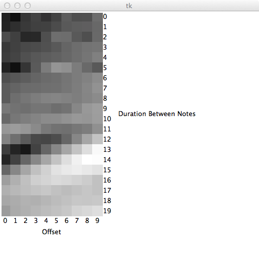

[music-ai](https://github.com/Glavin001/music-ai)
========

> Research project applying Artificial Intelligence to music.

## Installation

Using [pip](http://www.pip-installer.org/):

```bash
pip install -r requirements.txt
```

## Usage

```bash
python main.py <MIDI file path>
```

### Example

```bash
python main.py samples/chopin.mid
```

#### Screenshot



## Maintainer

Looking for a new maintainer with Dr. Oore.

## Original Author

- [Glavin Wiechert](https://github.com/Glavin001)
